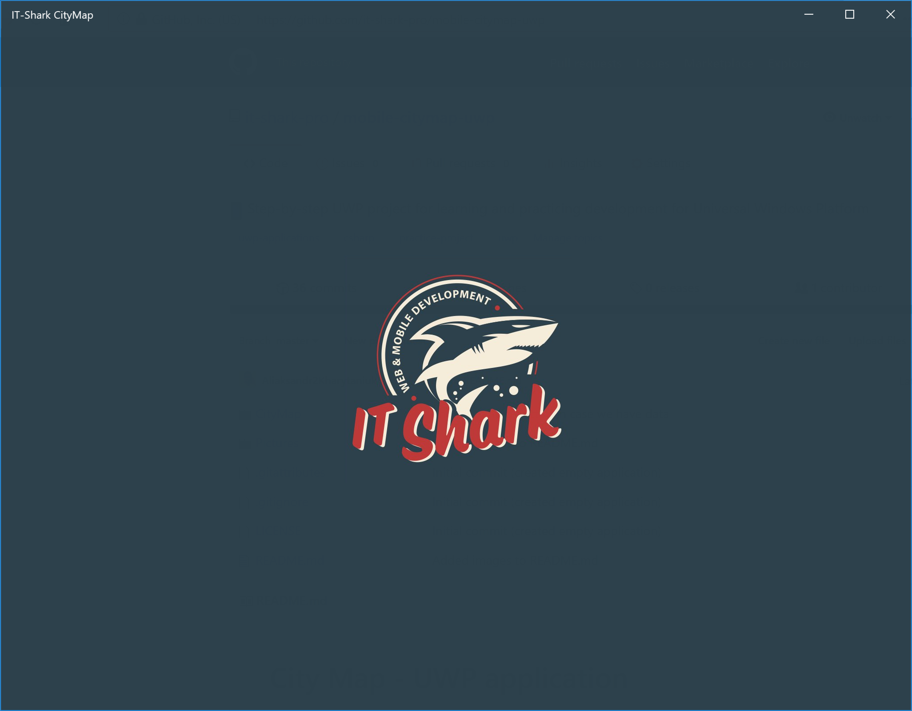
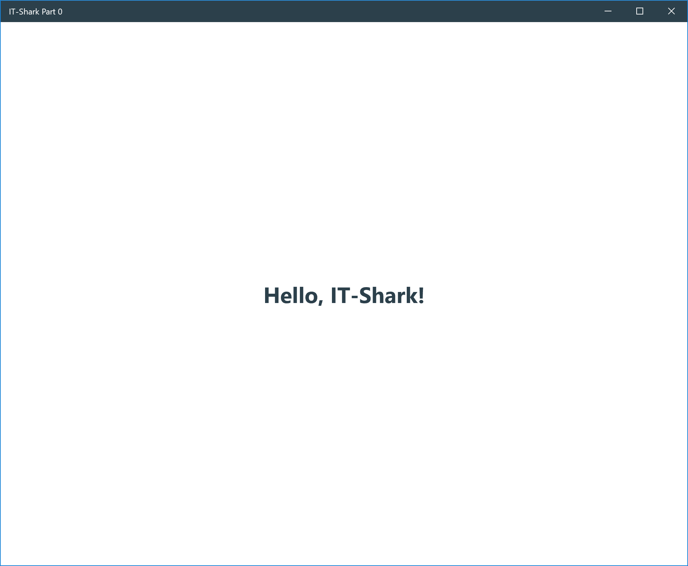
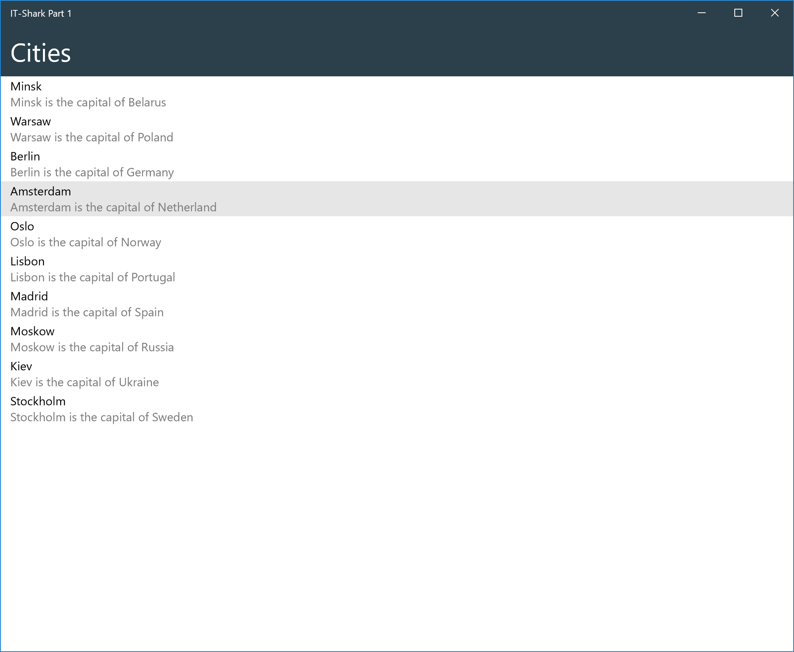
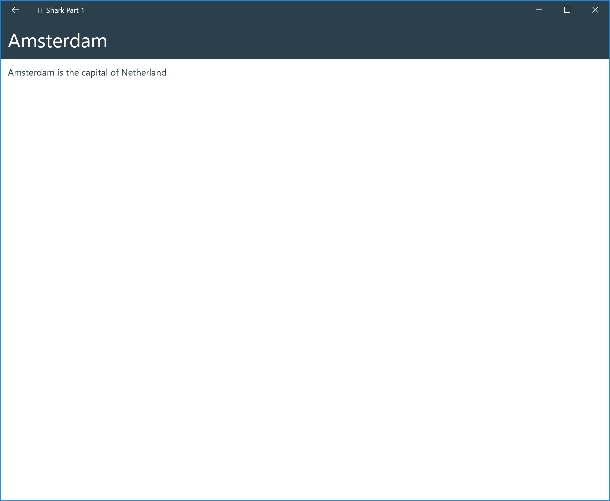
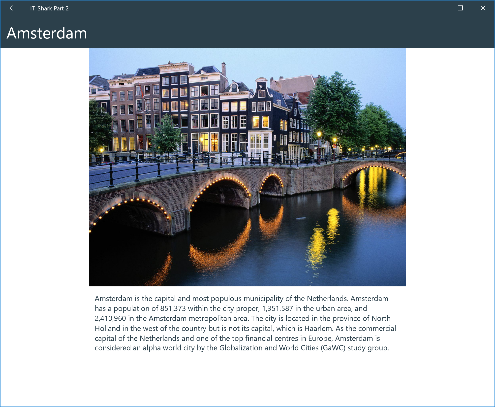
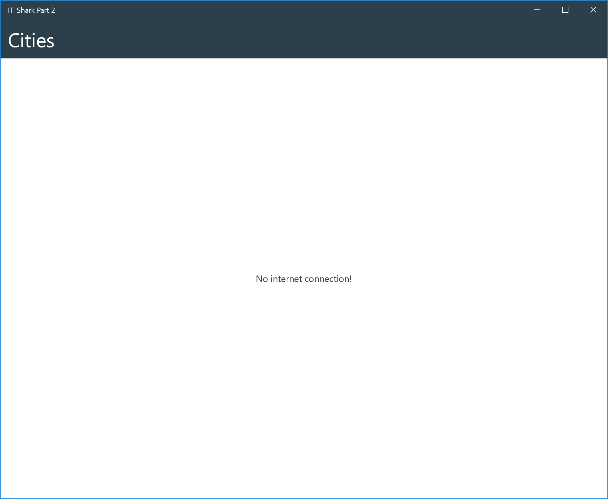
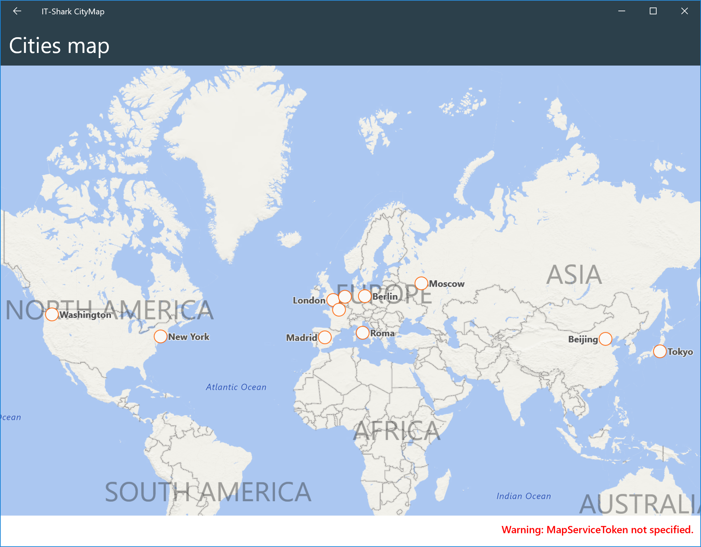

# City Map - UWP application

В данном репозитории расположены различные материалы для пошагового создания с нуля простого приложения **City Map** для платформы **UWP** на языке программирования **C#**.

**City Map** - мобильное приложение для просмотра базовой информации о различных городах.

### Основные функции:
- Постраничная навигация
- Загрузка данных из сети
- Оффлайн доступ к данным
- Отображение городов на мировой карте

## Для чего?

Если вас когда-либо интересовала нативная разработка для мобильных устройств на платформе **Windows 10** и Вы хотели бы попробовать себя в этом, то вы можете попробовать начать изучение, используя материалы из данного репозитория.

## Что нужно, чтобы начать?

Для того, чтобы начать изучать нативную мобильную разработку под **UWP**, Вам понадобится:
- Базовые знания английского языка (для чтения материалов);
- Базовое понимание платформы [**UWP**](https://docs.microsoft.com/ru-ru/windows/uwp/get-started/universal-application-platform-guide)
- Базовые знания языка программирования **С#**;
- Среда разработки **Visual Studio IDE** (Community 2017 или выше) с установленным пакетом SDK для Windows 10;
- Базовые навыки работы с [**Git**](https://try.github.io/levels/1/challenges/1) (для работы с материалами данного репозитория);

## Установка и настройка

- [Подготовка устройства к разработке](https://docs.microsoft.com/ru-ru/windows/uwp/get-started/enable-your-device-for-development)
- [Установка Visual Studo](https://docs.microsoft.com/ru-ru/visualstudio/install/install-visual-studio)
- [Установка SDK для Windows 10](https://developer.microsoft.com/ru-ru/windows/downloads/windows-10-sdk)

## Задания

Мы предлагаем Вам познакомиться с нативной разработкой под платформу **UWP** путем последовательного выполнения заданий по созданию приложения **CityMap**.

### Часть 0

В рамках данного задания требуется создать новый проект с одним экраном.
При необходимости добавить к нему Splash screen, иконки и задать цветовую схему приложения.

**Полезные материалы:**
- [Создание первого приложения "Hello, world" (XAML)](https://docs.microsoft.com/ru-ru/windows/uwp/get-started/create-a-hello-world-app-xaml-universal)

Результат, который должен получиться: [GitHub](https://github.com/it-shark-pro/mobile-citymap-uwp/tree/part0) | [Zip](https://github.com/it-shark-pro/mobile-citymap-uwp/archive/part0.zip)

### Часть 1

Данное задание требует создать список элементов (не более 10) с открытием экрана с детальным описанием после нажатия на конкретным элемент списка.
Каждый элемент списка это объект класса (структуры) с некоторым набором атрибутов и методов. Объекты класса как и сам список создаются программно в рамках приложения.
Объект класса (структуры) должен содержать такие поля как `Name` и `Description`.

**Полезные материалы:**
- [Работа с list view](https://docs.microsoft.com/ru-ru/windows/uwp/design/controls-and-patterns/listview-and-gridview)

Результат, который должен получиться: [GitHub](https://github.com/it-shark-pro/mobile-citymap-uwp/tree/part1) | [Zip](https://github.com/it-shark-pro/mobile-citymap-uwp/archive/part1.zip)

### Часть 2

В рамках данного задания требуется провести модификацию приложения полученного в [Часть 1 (Part 1)](#Часть-1) - заменить заданные вручную данные на полученные из сети в формате JSON.

Приложение должно проверять наличие интернет соединения и сообщать о его отсутствии при попытке сделать запрос в сеть для загрузки данных.

Ресурс для получения данных: https://api.myjson.com/bins/7ybe5

**Полезные материалы:**
- [Диспетчер пакетов NuGet](https://docs.microsoft.com/ru-ru/nuget/tools/package-manager-ui)
- [Асинхронное программирование с использованием ключевых слов Async и Await](https://docs.microsoft.com/ru-ru/dotnet/csharp/programming-guide/concepts/async/index)
- [Отправка и получение данных по протоколам HTTP2.0 и HTTP1.1](https://docs.microsoft.com/ru-ru/windows/uwp/networking/httpclient)
- [Работа с grid view](https://docs.microsoft.com/ru-ru/windows/uwp/design/controls-and-patterns/listview-and-gridview)
- [Работа с картинками](https://docs.microsoft.com/ru-ru/uwp/api/windows.ui.xaml.controls.image)

Результат, который должен получиться: [GitHub](https://github.com/it-shark-pro/mobile-citymap-uwp/tree/part2) | [Zip](https://github.com/it-shark-pro/mobile-citymap-uwp/archive/part2.zip)

### Часть 3

В рамках данного задания требуется организовать работу с базой данных. Полученные данные в рамках [Часть 2 (Part 2)](#Часть-2) должны сохраняться в кэш (SQLite, файл, др.), а после, в ситуации с отсутствие интернет-соединения/ошибкой при загрузке данных из сети, доставаться из нее и отображаться пользователю (можно использовать сторонние библиотеки).

Результат, который должен получиться: [GitHub](https://github.com/it-shark-pro/mobile-citymap-uwp/tree/part3) | [Zip](https://github.com/it-shark-pro/mobile-citymap-uwp/archive/part3.zip)

**Полезные материалы:**
- [Локальное хранилище данных](https://docs.microsoft.com/ru-ru/windows/uwp/design/app-settings/store-and-retrieve-app-data)

### Часть 4

В рамках данного задания требуется добавить отдельную страницу с картой, на которой будут отображены метки городов полученных из JSON координат.

**Полезные материалы:**
- [Добавление карты в UWP приложение](http://www.c-sharpcorner.com/article/add-map-to-your-uwp-app/)

Результат, который должен получиться: [GitHub](https://github.com/it-shark-pro/mobile-citymap-uwp/tree/part4) | [Zip](https://github.com/it-shark-pro/mobile-citymap-uwp/archive/part4.zip)

### Результат

Финальный результат доступен в [master](https://github.com/it-shark-pro/mobile-citymap-uwp) ветке и в качестве [Zip-архива](https://github.com/it-shark-pro/mobile-citymap-uwp/archive/master.zip).

## Q & A

Если у Вас возникли какие-то вопросы или предложения, как улучшить материал - [дайте нам знать](https://github.com/it-shark-pro/mobile-citymap-uwp/issues/new). :trophy: :+1:

## Другие варианты решения:

Дополнительно Вы можете ознакомиться с реализацией данного приложения для других платформ, а также найти кроссплатформенное решение:
- [City Map - iOS - Swift](https://github.com/it-shark-pro/mobile-citymap-ios)
- [City Map - Android - Java](https://github.com/it-shark-pro/mobile-citymap-android)
- [City Map - Android & iOS applications - Xamarin](https://github.com/it-shark-pro/mobile-citymap-xamarin)
